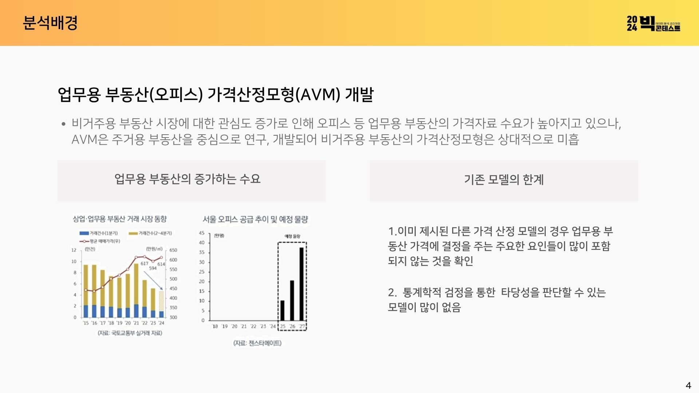
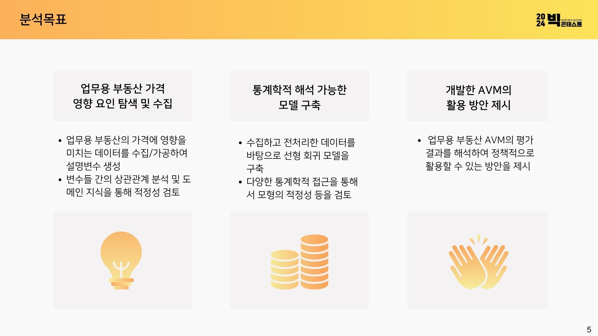
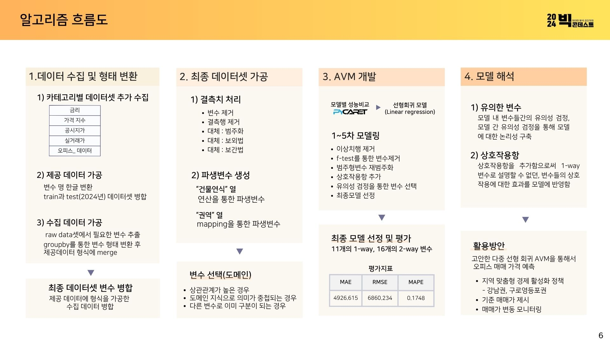
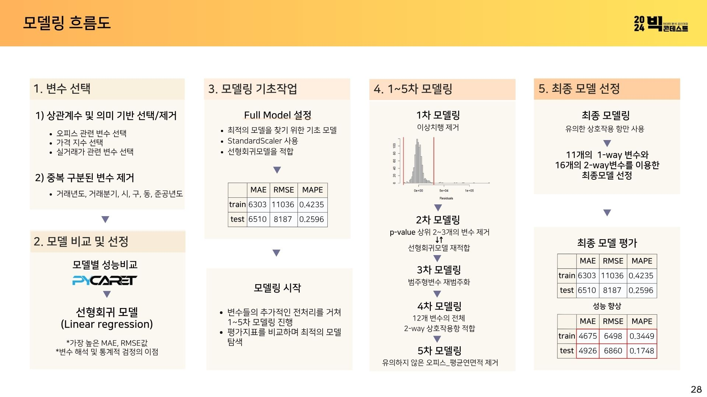

# 2024 빅콘테스트 - 상업업무용 부동산(오피스) 가격 예측

2024 빅데이터 분석 콘테스트 부동산 플랫폼 분야 출품작으로, 오피스 매매 실거래가 데이터를 중심으로 여러 거시/부동산 지표를 결합해 거래가를 예측하는 회귀 모델을 구축했습니다.

## 분석 배경 및 목표

비주거용 부동산 시장에 대한 관심이 높아지고 있지만, 기존 AVM(자동가치평가모형) 연구는 주거용 부동산 중심으로 이뤄져 업무용(오피스) 부동산의 가격산정모형은 상대적으로 미흡합니다.



이에 따라 다음 3가지를 목표로 분석을 진행했습니다.
1. 업무용 부동산 가격에 영향을 미치는 요인 탐색 및 데이터 수집
2. 통계학적으로 해석 가능한 모델 구축
3. 개발한 AVM의 활용 방안 제시



## 데이터 파이프라인

```
data/raw/  (원본 데이터, 12개 소스)
    │
    ▼  code/01_preprocessing1.ipynb   — 형태 변환, 소스별 병합
data/processed1_merged.csv
data/processed1_업무용_실거래가_연면적당평균.csv
data/processed1_주거용_실거래가_연면적당평균.csv
data/processed1_주거용_실거래가_연면적당평균_건물용도별.csv
    │
    ▼  code/02_preprocessing2.ipynb   — 결측치 처리, 건물연식 추가, 변수명 특수문자 제거
data/processed2_merged.csv
    │
    ▼  (건물연식 등 최종 피처 정리)
data/final_merged.csv                — 모델링 최종 입력 데이터 (968행 x 43열)
    │
    ▼  code/03_modeling.ipynb        — 회귀 모델링
```

## 폴더 구조

```
2024-Bigcontest-RealEstate/
├── data/
│   ├── raw/                                                  # 원본 데이터 (용량 문제로 git 미포함, 하단 출처 참고)
│   ├── processed1_merged.csv
│   ├── processed1_업무용_실거래가_연면적당평균.csv
│   ├── processed1_주거용_실거래가_연면적당평균.csv
│   ├── processed1_주거용_실거래가_연면적당평균_건물용도별.csv
│   ├── processed2_merged.csv
│   └── final_merged.csv
└── code/
    ├── 01_preprocessing1.ipynb    # 1차 전처리: raw 데이터 형태 변환 및 병합
    ├── 02_preprocessing2.ipynb    # 2차 전처리: 결측치 처리, 건물연식 추가, 변수명 정리
    └── 03_modeling.ipynb          # 모델링: 회귀분석, 잔차/VIF 진단
```

## 원본 데이터 출처

| 데이터 | 출처 |
|---|---|
| 오피스 매매데이터 (빅콘테스트 제공) | 빅콘테스트 2024 부동산빅데이터플랫폼 |
| 월간 아파트 매매가격지수 | 한국부동산원 |
| 상업업무용(매매) 실거래가 (서울/분당) | 국토교통부 실거래가 공개시스템 |
| 표준지공시지가 (2014~2024) | 국토교통부 |
| 서울시 부동산 실거래가 정보 (2014~2024) | 서울 열린데이터광장 |
| 기준금리 | 한국은행 경제통계시스템 |
| 소비자물가지수 | 통계청 |
| 건설공사비지수 | 한국건설기술연구원 |
| 상업용부동산 임대동향조사 | 한국부동산원 |
| 분기별 KB오피스 투자지수 | KB경영연구소 |

## 알고리즘 흐름도



## 모델링 개요



- **타겟 변수**: 거래가
- **Train/Test 분할**: 거래년도 2024를 Test set, 그 외 연도를 Train set으로 시계열 기준 분할
- **모델 선정**: PyCaret으로 여러 모델 성능을 비교한 뒤, 변수 해석 및 통계적 검정이 가능한 Linear Regression을 최종 채택
- **모델링 단계**: Full Model → 1차(이상치행 제거) → 2차(p-value 상위 변수 제거 후 재적합) → 3차(범주형 변수 재범주화) → 4차(2-way 상호작용항 적합) → 5차(유의하지 않은 변수 제거) → 최종 모델(11개 1-way + 16개 2-way 변수)
- **최종 성능(Test)**: MAE 4,926.6 / RMSE 6,860.2 / MAPE 17.48% (Full Model 대비 MAPE 25.96% → 17.48%로 개선)
- **진단**: 잔차 플롯, f-test 기반 변수 유의성 검정

## 실행 방법

1. `data/raw/`에 원본 데이터를 위 출처에서 받아 배치
2. `code/01_preprocessing1.ipynb` → `02_preprocessing2.ipynb` → `03_modeling.ipynb` 순서로 실행

## Tech Stack

Python, pandas, numpy, matplotlib, seaborn, scikit-learn, statsmodels
